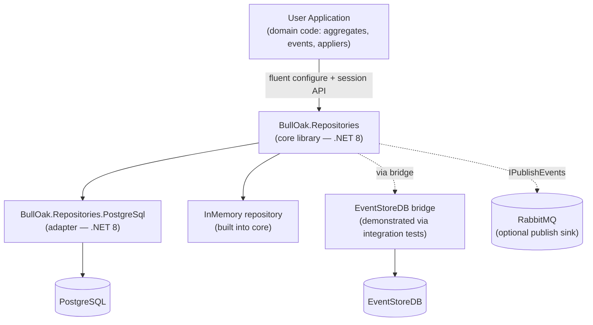
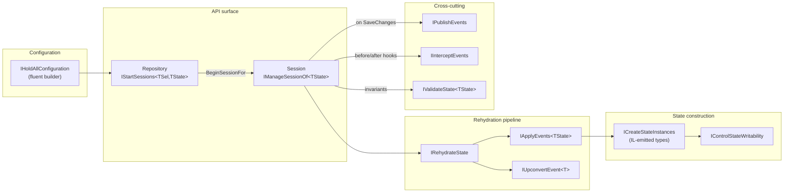
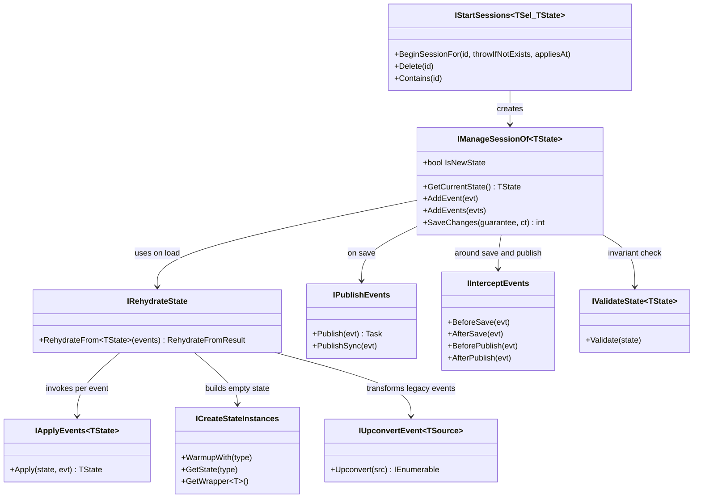
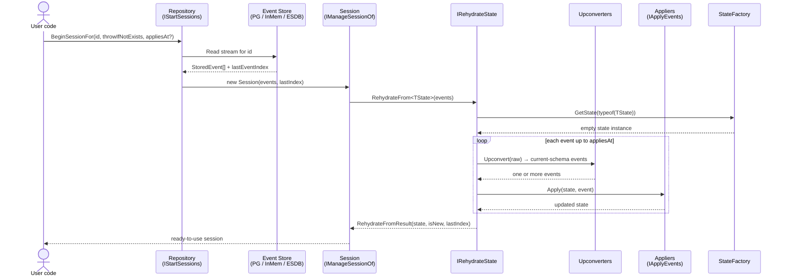
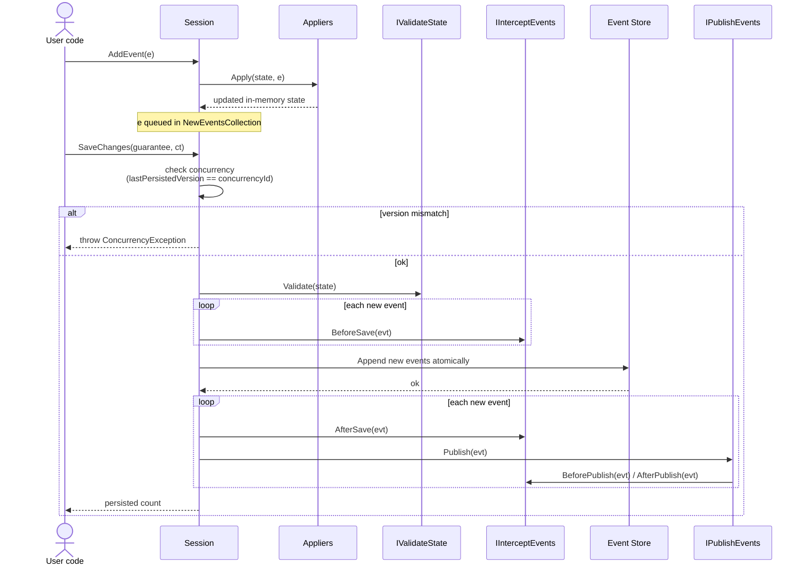
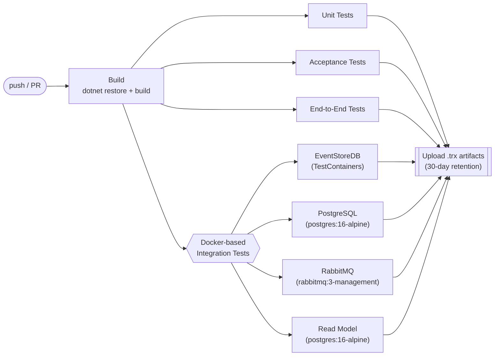

# BullOak Architecture Diagrams

This document provides a visual overview of BullOak — a .NET event-sourcing library — using Mermaid diagrams. It is intended as a fast onboarding reference that complements the in-depth prose in the root [`README.md`](../README.md).

All diagrams render natively on GitHub. If you are viewing this outside GitHub, any Mermaid-aware renderer (VS Code preview, Obsidian, mermaid.live) will work.

---

## 1. System Context

Where BullOak sits between a user's application and the backing event store / messaging infrastructure.

**Reading it:** solid arrows are first-class runtime dependencies; dashed arrows are optional / pluggable integrations exercised by the integration test suite.

---

## 2. Core Component Map

The internal components of `BullOak.Repositories` and how they collaborate at runtime.

**Reading it:** the session is the unit of work. Rehydration is a read-side pipeline (events → state); save-time concerns (publish, intercept, validate) are orthogonal cross-cutting services.

---

## 3. Key Abstractions — Class Diagram

The public interfaces that define BullOak's extensibility points.

**Reading it:** every dependency here is injectable via the fluent `IHoldAllConfiguration` builder — production code swaps these to change persistence, publishing, or event-schema evolution strategy.

---

## 4. Sequence: Load / Rehydrate a Session

What happens when a user calls `repository.BeginSessionFor(id)`.

**Reading it:** point-in-time queries are served by truncating the replay loop at `appliesAt` — the store still returns the full stream, but the rehydrator stops early.

---

## 5. Sequence: Apply New Events and Save

`session.AddEvent(...)` followed by `session.SaveChanges(...)`.

**Reading it:** state mutation happens *immediately* on `AddEvent` (optimistic), but persistence and publishing only happen on `SaveChanges`. The concurrency check is the mechanism that prevents lost updates across concurrent sessions for the same aggregate.

---

## 6. Solution / Project Structure

The .csproj graph — library, adapter, sample, and test projects, with dependency edges.

```mermaid
graph TD
    Core["BullOak.Repositories<br/>(core — .NET 8)"]
    PG["BullOak.Repositories.PostgreSql<br/>(adapter — .NET 8)"]
    Console["BullOak.Console<br/>(sample — .NET 8)"]

    UT["BullOak.Repositories.Test.Unit"]
    UTUp["BullOak.Repositories.Test.Unit.UpconverterContainer"]
    Acc["BullOak.Repositories.Test.Acceptance"]
    E2E["BullOak.Test.EndToEnd"]
    Bench["BullOak.Test.Benchmark"]
    ESInt["BullOak.Test.EventStore.Integration<br/>(net6.0 — TestContainers)"]
    PGInt["BullOak.Test.PostgreSql.Integration<br/>(TestContainers)"]
    RMQInt["BullOak.Test.RabbitMq.Integration<br/>(TestContainers)"]
    RMInt["BullOak.Test.ReadModel.Integration<br/>(TestContainers)"]

    PG --> Core
    Console --> Core
    UT --> Core
    UTUp --> Core
    Acc --> Core
    E2E --> Core
    Bench --> Core
    ESInt --> Core
    PGInt --> Core
    PGInt --> PG
    RMQInt --> Core
    RMInt --> Core
    RMInt --> PG

    classDef lib fill:#dbeafe,stroke:#1e3a8a
    classDef test fill:#fef3c7,stroke:#92400e
    classDef sample fill:#dcfce7,stroke:#166534
    class Core,PG lib
    class Console sample
    class UT,UTUp,Acc,E2E,Bench,ESInt,PGInt,RMQInt,RMInt test
```

**Reading it:** the fan-in to `Core` shows how small the library's public surface must stay — every test project and adapter couples to it.

---

## 7. CI Pipeline

The GitHub Actions workflow at `.github/workflows/ci.yml`.

**Reading it:** Docker tests are parallelizable because each TestContainers fixture is isolated per test project. Artifact upload is a fan-in sink used for post-run inspection.

---

## Updating these diagrams

When any of the following change, this document should be refreshed:

- Public interfaces in `src/BullOak.Repositories/` — affects diagrams 2 and 3.
- New persistence adapter added — affects diagrams 1 and 6.
- Session load/save behaviour changes (e.g., batching, new hook points) — affects diagrams 4 and 5.
- CI workflow in `.github/workflows/ci.yml` gains or drops jobs — affects diagram 7.

Prefer updating this file in the same PR as the code change so the diagrams do not drift.
